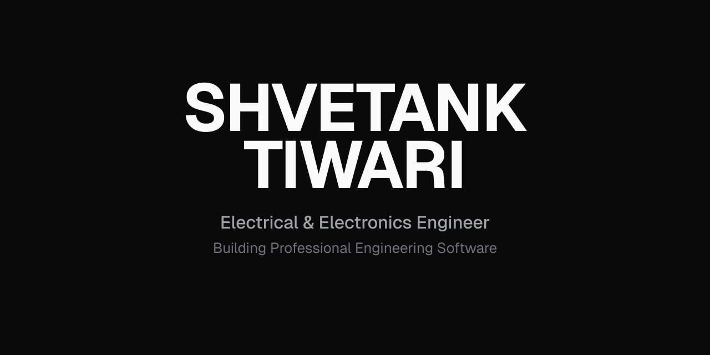

<p align="center">
  
</p>

<h2 align="center">Building Professional Engineering Software</h2>

<p align="center">
I build engineering software for power systems, electric vehicles, renewable energy and industrial automation.
</p>

<br>

## About

I am an Electrical & Electronics Engineering undergraduate at **VIT Chennai** focused on building software that solves real engineering problems.

Rather than developing software for software's sake, I enjoy creating applications that engineers can actually use. Whether that's analysing battery performance, simulating electric vehicle systems, or developing tools for power engineering.

My goal is to combine engineering principles with modern software development to create software that is reliable, intuitive and built for real-world use.

---

# Featured Projects

## EV Hub Motor Performance Simulator

Professional engineering software for analysing electric vehicle hub motors.

**Highlights**

- Torque-Speed Analysis
- Power-Speed Analysis
- Vehicle Dynamics
- Battery Configuration
- Interactive Engineering Graphs

**Built With**

<p>
  
  
  
  
  
</p>

**Repository**

> https://github.com/Shv8ank/EV-Hub-Motor-Performance-Simulator.git

**Live Demo**

https://ev-motor-performance-simulator.streamlit.app

---

## Battery SoC Estimator

Battery analysis software supporting multiple battery chemistries.

**Highlights**

- Lithium-ion
- LiFePO₄
- Lead Acid
- Voltage → SoC Estimation
- CSV Analysis
- Interactive Charts

**Built With**

<p>
  
  
  
  
  
</p>

**Repository**

> https://github.com/Shv8ank/Battery-SOC-Estimator

**Live Demo**

https://battery-soc-estimator.streamlit.app

---

## MPPT Algorithm for Solar PV Systems

MATLAB/Simulink implementation of Maximum Power Point Tracking algorithms for photovoltaic systems.

**Built With**

<p>
  
  
</p>

**Repository**

> https://github.com/Shv8ank/MPPT-Algorithm-PV.git

---

# Technologies

### Languages

- Python
- Java
- C
- Embedded C
- R

### Engineering Software

- MATLAB
- Simulink
- ANSYS
- Motor-CAD
- LTspice
- KiCad
- Proteus
- Keil µVision

### Scientific Computing

- NumPy
- Pandas

### Development

- Git
- GitHub
- VS Code

---

# Currently Building

- Open-source engineering software
- Engineering simulation tools
- Industrial automation applications
- Power system analysis software

---

# Contact

<p align="center">

<a href="mailto:shv8ank@gmail.com">

</a>

<a href="https://www.linkedin.com/in/shvetank-tiwari-2777a7215/">

</a>

</p>

<br>

<p align="center">

Building Professional Engineering Software.

</p>
```
